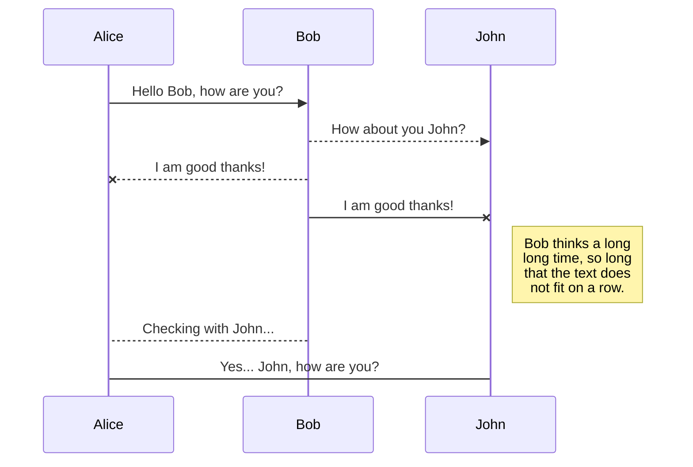
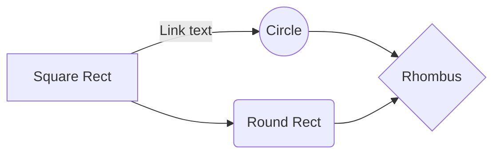

# _

¡Hola, bienvenido a la Universidad del Norte!, yo soy ___, tú asistente en este trayecto para completar y finalizar con éxito tú proceso de matrícula.
¿Hay algo en lo que pueda ayudarte?

## ERROR 
Lo siento, no puedo brindarte esa información. 

## ¿Cuándo se abren inscripciones?

## ¿Cuánto cuesta la inscripción?

En la universidad del Norte el valor es de **$ 115.500**. ¡Ojo! El valor de la inscripción no es reembolsable. 
De igual forma, existen descuentos y si deseas participar en la convocatoria de Becas Uninorte, obtienes un valor especial de inscripción, pagando $33.800

## ¿Hay descuentos en la inscripción?
Sí, en Uninorte ofrecen descuentos, de hecho al participar en la convocatoria de Becas Uninorte, obtienes un valor especial de inscripción, pagando $33.800

## ¿Qué requisitos se necesitan para inscribirse a nuevo ingreso?
Los requisitos para inscribirte son: ser bachiller o estar próximo a graduarte, diligenciar el formulario de inscripción; podrás acceder a el a través de este link:  
[Acceso a Admisiones (uninorte.edu.co)](https://pomelo.uninorte.edu.co/pls/prod/bwskalog.P_DispLoginNon) 
A su vez, se debe adjuntar las notas de los dos últimos años cursados. 

## ¿Cuál es el precio de la matrícula del programa de Negocios Internacionales? ¿Cuánto cobran en el programa de Negocios Internacionales?

En el programa de Negocios Internacionales en Barranquilla el valor es de 15,285,100$ de pesos, semestral. 
(Este valor tiene vigencia hasta 202410)

## ¿Cuál es el precio de la matrícula del programa de Contaduría Pública? ¿Cuánto cobran en el programa de Contaduría Pública?
En el programa de Contaduría Pública en Barranquilla el valor es de 6,776,400$ de pesos, semestral. 
(Este valor tiene vigencia hasta 202410)

## ¿Cuál es el precio de la matrícula del programa de Administración de Empresas? ¿Cuánto cobran en el programa de Administración de Empresas?
En el programa de Administración de Empresas en Barranquilla el valor es de 13,735,000$ de pesos, semestral. 
(Este valor tiene vigencia hasta 202410)

## ¿Qué programas están en la Escuela de Negocios?
En la Escuela de Negocios en Barranquilla se encuentran los programas de:

- Negocios Internacionales en $15,285,100, semestral.
- Contaduría Pública en $6,776,400, semestral.
 - Administración de Empresas en $13,735,000, semestral.
(Estos valores tienen vigencia hasta 202410) 

## ¿Cuál es el precio de la matrícula del programa de Arquitectura? ¿Cuánto cobran en el programa de Arquitectura?
En el programa de Arquitectura en Barranquilla el valor es de 11,378,700$ de pesos, semestral. 
(Este valor tiene vigencia hasta 202410)

## ¿Cuál es el precio de la matrícula del programa de Diseño Gráfico? ¿Cuánto cobran en el programa de Diseño Gráfico?
En el programa de Arquitectura en Barranquilla el valor es de 14,173,000$ de pesos, semestral. 
(Este valor tiene vigencia hasta 202410)

## Publish a File

You can publish your file by opening the **Publish** sub-menu and by clicking **Publish to**. For some locations, you can choose between the following formats:

- Markdown: publish the Markdown text on a website that can interpret it (**GitHub** for instance),
- HTML: publish the file converted to HTML via a Handlebars template (on a blog for example).

## Update a publication

After publishing, StackEdit keeps your file linked to that publication which makes it easy for you to re-publish it. Once you have modified your file and you want to update your publication, click on the **Publish now** button in the navigation bar.

> **Note:** The **Publish now** button is disabled if your file has not been published yet.

## Manage file publication

Since one file can be published to multiple locations, you can list and manage publish locations by clicking **File publication** in the **Publish** sub-menu. This allows you to list and remove publication locations that are linked to your file.

# Markdown extensions

StackEdit extends the standard Markdown syntax by adding extra **Markdown extensions**, providing you with some nice features.

> **ProTip:** You can disable any **Markdown extension** in the **File properties** dialog.

## SmartyPants

SmartyPants converts ASCII punctuation characters into "smart" typographic punctuation HTML entities. For example:

|                |ASCII                          |HTML                         |
|----------------|-------------------------------|-----------------------------|
|Single backticks|`'Isn't this fun?'`            |'Isn't this fun?'            |
|Quotes          |`"Isn't this fun?"`            |"Isn't this fun?"            |
|Dashes          |`-- is en-dash, --- is em-dash`|-- is en-dash, --- is em-dash|

## KaTeX

You can render LaTeX mathematical expressions using [KaTeX](https://khan.github.io/KaTeX/):

The *Gamma function* satisfying $\Gamma(n) = (n-1)!\quad\forall n\in\mathbb N$ is via the Euler integral

$$
\Gamma(z) = \int_0^\infty t^{z-1}e^{-t}dt\,.
$$

> You can find more information about **LaTeX** mathematical expressions [here](http://meta.math.stackexchange.com/questions/5020/mathjax-basic-tutorial-and-quick-reference).

## UML diagrams

You can render UML diagrams using [Mermaid](https://mermaidjs.github.io/). For example, this will produce a sequence diagram:

And this will produce a flow chart:

