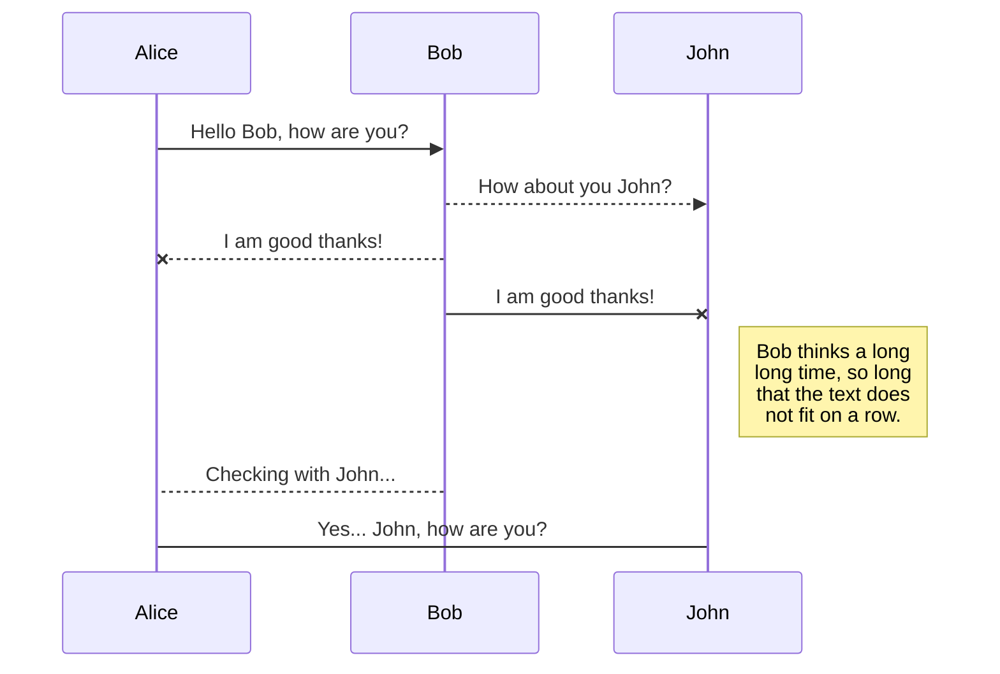
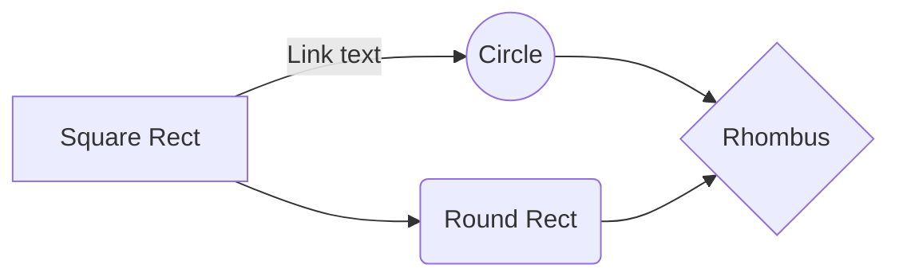

# ______

Hola! yo soy_____ tu asistente en este trayecto para asistirme en la búsqueda de información tanto de visitas, las exposiciones, horarios de estas, colecciones, programas académicos, eventos importantes, entre otros; además de recorridos tanto virtuales como físicos.
 

# ERROR

Lo siento, no puedo bridarte esa información.

## ¿Qué expone el museo en su calendario?
En su calendario de exposiciones temporales, el Museo presenta muestras de historia, arte y arqueología nacionales e internacionales. Adicionalmente, brinda una variada programación académica y cultural que incluye conferencias, conciertos, presentaciones de teatro y danza y proyecciones audiovisuales, entre otros.

## ¿Cuantas salas de exposición hay en el museo?
 El museo cuenta con diecisiete salas de exposición permanentes.
 
## ¿Cuantas obras y objetos exhibe el museo nacional de Colombia?
En el museo nacional de Colombia, se exhiben alrededor de 2.500 obras y objetos, símbolos de la historia y el patrimonio nacional.

## ¿Qué hay de las visitas?

 El Museo Nacional de Colombia fue creado en 1823, y es uno de los más antiguos de América. Ofrece a sus visitantes diecisiete salas de exposición permanente, en las cuales se exhiben alrededor de 2.500 obras y objetos, símbolos de la historia y el patrimonio nacional. En su calendario de exposiciones temporales, el Museo presenta muestras de historia, arte y arqueología nacionales e internacionales. Adicionalmente, brinda una variada programación académica y cultural que incluye conferencias, conciertos, presentaciones de teatro y danza y proyecciones audiovisuales, entre otros.

## ¿Cuál es la ubicación del museo nacional de Colombia?
El Museo Nacional de Colombia está localizado en el corazón del Centro Internacional, sobre la carrera 7, entre calles 28 y 29.

## ¿Cómo llegar?
- En autobús  
* Desde el sur por la carrera 10 y desde el Norte por la Carrera 13.

-  En carro  
* Ruta de llegada por la Carrera 5: bajando por la calle 30 o la calle 28.  
* Parqueaderos en la Calle 28 y en la carrera 6, entre calle 28 y calle 27.

- En Transmilenio  
* Estación Museo Nacional - Carrera 7

* Estación Calle 26

## ¿El Museo tiene servicio de parqueadero y bici parqueadero?
El museo no consta de un parqueadero o bici parqueadero propio. Sin embargo, las personas que nos visiten podrán acceder a una tarifa especial de parqueadero en City Parking de la Plaza de Toros en la Calle 28 # 5-23 en Bogotá.

  

Nuestros visitantes deberán presentar el desprendible de la boleta de entrada al Museo y se le otorgará el descuento en la tarifa plena hasta por 12 horas continuas, así:  Carro $11.000 | Moto $5.000 | Bicicleta $1.500 
## ¿Qué es del museo hoy en día?
Actualmente, el Museo adelanta un proceso de reforma de sus salas de exposición permanente, con el fin de renovar la representación de la nación, incluir múltiples voces que den cuenta de su diversidad cultural y natural y actualizar la forma de comunicar a los distintos públicos.
## ¿Qué hay de las exposiciones?

El Museo Nacional de Colombia ofrece a sus visitantes salas de exposición permanente, en las cuales se exhiben alrededor de 2.500 objetos; un calendario de exposiciones temporales que ha permitido a los colombianos estar en contacto con importantes muestras de historia, arte y arqueología nacionales e internacionales.

## ¿Qué tipos de exposiciones se encuentran?

Se pueden encontrar: 
* Exposiciones permanentes
* Exposiciones temporales 
* Exposiciones 

## ¿Cuáles son las exposiciones permanentes? 

[**LA HISTORIA DEL MUSEO Y**  
**EL MUSEO EN LA HISTORIA**  
The History of the Museum and the Museum in the History](https://museonacional.gov.co/exposiciones/permanentes/Paginas/Primer_piso/1.aspx)

[**HISTORIA DEL PANÓPTICO**  
History of the Panoptic](https://museonacional.gov.co/exposiciones/permanentes/Paginas/Primer_piso/2.aspx)
**[  
TIEMPO SIN OLVIDO: DIÁLOGOS DESDE EL MUNDO PREHISPÁNICO](https://museonacional.gov.co/exposiciones/permanentes/Paginas/Primer_piso/3.aspx)**[Time Unforgotten: Dialogues  
from the Pre-Hispanic World](https://museonacional.gov.co/exposiciones/permanentes/Paginas/Primer_piso/3.aspx)

[**MEMORIA EN MOVIMIENTO  
**Memory in Motion](https://museonacional.gov.co/exposiciones/permanentes/Paginas/Primer_piso/4.aspx)

**[TALLERES DEL PANÓPTICO Y RESERVA VISIBLE](https://museonacional.gov.co/exposiciones/permanentes/Paginas/Primer_piso/5.aspx)**

[Panoptic workshops and](https://museonacional.gov.co/exposiciones/permanentes/Paginas/Tercer_piso/14.aspx "TALLERES DEL PANÓPTICO Y RESERVA VISIBLE")

[**BRILLANTE AMANECER. LA METALURGIA DEL ORO EN EL MUNDO INDÍGENA**](https://museonacional.gov.co/exposiciones/permanentes/Paginas/Primer_piso/6.aspx)  
Bright Dawn. The Metallurgy of Gold  
in the Indigenous World

## ¿En donde se encuentra la exposición de LA HISTORIA DEL MUSEO Y EL MUSEO DE LA HISTORIA?
La exposición de LA HISTORIA DEL MUSEO Y EL MUSEO DE LA HISTORIA se encuentra ubicada en el primer piso en la sala 1.  

## ¿En donde se encuentra la exposición de HISTORIA DEL PANÓPTICO?
La exposición de HISTORIA DEL PAÓPTICO se encuentra ubicada en el primer piso en la sala 2.  

## ¿En donde se encuentra la exposición TIEMPO SIN OLVIDO: DÍALOGOS DESDE EL MUNDO PREHISPÁNICO?
La exposición TIEMPO SIN OLVIDO: DÍALOGO DESDE EL MUNDO PREHISPÁNICO se encuentra ubicada en el primer piso en la sala 3.  
## ¿En donde se encuentra la exposición MEMORIA EN MOVIMIENTO?
La exposición MEMORIA 

​

## Delete a file

You can delete the current file by clicking the **Remove** button in the file explorer. The file will be moved into the **Trash** folder and automatically deleted after 7 days of inactivity.

## Export a file

You can export the current file by clicking **Export to disk** in the menu. You can choose to export the file as plain Markdown, as HTML using a Handlebars template or as a PDF.

# Synchronization

Synchronization is one of the biggest features of StackEdit. It enables you to synchronize any file in your workspace with other files stored in your **Google Drive**, your **Dropbox** and your **GitHub** accounts. This allows you to keep writing on other devices, collaborate with people you share the file with, integrate easily into your workflow... The synchronization mechanism takes place every minute in the background, downloading, merging, and uploading file modifications.

There are two types of synchronization and they can complement each other:

- The workspace synchronization will sync all your files, folders and settings automatically. This will allow you to fetch your workspace on any other device.
	> To start syncing your workspace, just sign in with Google in the menu.

- The file synchronization will keep one file of the workspace synced with one or multiple files in **Google Drive**, **Dropbox** or **GitHub**.
	> Before starting to sync files, you must link an account in the **Synchronize** sub-menu.

## Open a file

You can open a file from **Google Drive**, **Dropbox** or **GitHub** by opening the **Synchronize** sub-menu and clicking **Open from**. Once opened in the workspace, any modification in the file will be automatically synced.

## Save a file

You can save any file of the workspace to **Google Drive**, **Dropbox** or **GitHub** by opening the **Synchronize** sub-menu and clicking **Save on**. Even if a file in the workspace is already synced, you can save it to another location. StackEdit can sync one file with multiple locations and accounts.

## Synchronize a file

Once your file is linked to a synchronized location, StackEdit will periodically synchronize it by downloading/uploading any modification. A merge will be performed if necessary and conflicts will be resolved.

If you just have modified your file and you want to force syncing, click the **Synchronize now** button in the navigation bar.

> **Note:** The **Synchronize now** button is disabled if you have no file to synchronize.

## Manage file synchronization

Since one file can be synced with multiple locations, you can list and manage synchronized locations by clicking **File synchronization** in the **Synchronize** sub-menu. This allows you to list and remove synchronized locations that are linked to your file.

# Publication

Publishing in StackEdit makes it simple for you to publish online your files. Once you're happy with a file, you can publish it to different hosting platforms like **Blogger**, **Dropbox**, **Gist**, **GitHub**, **Google Drive**, **WordPress** and **Zendesk**. With [Handlebars templates](http://handlebarsjs.com/), you have full control over what you export.

> Before starting to publish, you must link an account in the **Publish** sub-menu.

## Publish a File

You can publish your file by opening the **Publish** sub-menu and by clicking **Publish to**. For some locations, you can choose between the following formats:

- Markdown: publish the Markdown text on a website that can interpret it (**GitHub** for instance),
- HTML: publish the file converted to HTML via a Handlebars template (on a blog for example).

## Update a publication

After publishing, StackEdit keeps your file linked to that publication which makes it easy for you to re-publish it. Once you have modified your file and you want to update your publication, click on the **Publish now** button in the navigation bar.

> **Note:** The **Publish now** button is disabled if your file has not been published yet.

## Manage file publication

Since one file can be published to multiple locations, you can list and manage publish locations by clicking **File publication** in the **Publish** sub-menu. This allows you to list and remove publication locations that are linked to your file.

# Markdown extensions

StackEdit extends the standard Markdown syntax by adding extra **Markdown extensions**, providing you with some nice features.

> **ProTip:** You can disable any **Markdown extension** in the **File properties** dialog.

## SmartyPants

SmartyPants converts ASCII punctuation characters into "smart" typographic punctuation HTML entities. For example:

|                |ASCII                          |HTML                         |
|----------------|-------------------------------|-----------------------------|
|Single backticks|`'Isn't this fun?'`            |'Isn't this fun?'            |
|Quotes          |`"Isn't this fun?"`            |"Isn't this fun?"            |
|Dashes          |`-- is en-dash, --- is em-dash`|-- is en-dash, --- is em-dash|

## KaTeX

You can render LaTeX mathematical expressions using [KaTeX](https://khan.github.io/KaTeX/):

The *Gamma function* satisfying $\Gamma(n) = (n-1)!\quad\forall n\in\mathbb N$ is via the Euler integral

$$
\Gamma(z) = \int_0^\infty t^{z-1}e^{-t}dt\,.
$$

> You can find more information about **LaTeX** mathematical expressions [here](http://meta.math.stackexchange.com/questions/5020/mathjax-basic-tutorial-and-quick-reference).

## UML diagrams

You can render UML diagrams using [Mermaid](https://mermaidjs.github.io/). For example, this will produce a sequence diagram:

And this will produce a flow chart:

